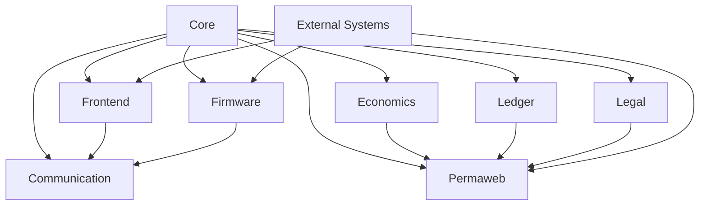

# MASTER_PROJECT Architecture Overview

## System Architecture

MASTER_PROJECT implements a **delta topology** - a decentralized, resilient network where no single point of failure can compromise the entire system. This contrasts with the vulnerable "wye topology" of centralized systems.

## Component Interdependencies



## Data Flow Architecture

### Sovereign Data Pipeline

1. **Input Processing** (Frontend → Communication)
   - VPI analysis of human communication
   - Dialect detection and translation
   - Impedance matching

2. **Core Processing** (Core)
   - Tetrahedron protocol validation
   - Quantum state calculations
   - Constitutional compliance checking

3. **Storage Layer** (Permaweb)
   - Arweave permanent storage
   - Cryptographic integrity proofs
   - Sovereignty declarations

4. **Economic Layer** (Economics + Ledger)
   - Proof-of-care consensus
   - Dynamic equity distribution
   - Sovereign value flows

5. **Hardware Integration** (Firmware)
   - ESP32 mesh networking
   - Hardware root of trust
   - Quantum key distribution

## Communication Protocols

### VPI (Variable Phase Impedance) Protocol

The VPI protocol enables impedance-matched communication between different human operating systems:

#### Dialect Translation Matrix

| Source | Target | Example Translation |
|--------|--------|-------------------|
| Engineering | Astrology | "High Impedance" → "Deep Conditioning Treatment" |
| Engineering | Cosmetology | "Floating Neutral" → "Hot Roots" |
| Astrology | Cosmetology | "Saturn Return" → "Growing Out Roots" |

#### Impedance Matching Algorithm

```typescript
interface ImpedanceMatch {
  sourceDialect: string;
  targetDialect: string;
  impedanceDelta: number;
  successProbability: number;
}
```

### Tetrahedron Protocol

All system communication follows tetrahedral geometry:

- **4 Vertices**: A (sender), B (receiver), Context, AI
- **6 Edges**: Communication pathways
- **4 Faces**: Meaning surfaces
- **Batching Window**: 60-second Catcher's Mitt
- **Vacuum of Time**: 3-second mandatory delay

## Security Architecture

### Multi-Layer Security

1. **Physical Layer** (Firmware)
   - Hardware root of trust (NXP SE050)
   - TPM-backed key generation
   - Secure boot process

2. **Network Layer** (Permaweb)
   - Arweave permanent storage
   - Zero-knowledge proofs
   - Decentralized consensus

3. **Application Layer** (Core)
   - Post-quantum cryptography
   - Zero-trust architecture
   - Constitutional violation detection

### Threat Model

#### Attack Vectors Addressed
- **Centralized Control**: Delta topology prevents single points of failure
- **Data Censorship**: Arweave permanent storage
- **Communication Interception**: End-to-end encryption with PQ crypto
- **Legal Intimidation**: Adams Challenge automation
- **Economic Coercion**: Sovereign economics with proof-of-care

## Quantum Integration

### Fisher-Escola Framework

The system implements quantum consciousness principles:

#### Posner Molecule Dynamics
- **Formula**: Ca₉(PO₄)₆
- **Coherence Time**: ~24 hours
- **Nuclear Spin**: Phosphorus-31 (I = 1/2)

#### SIC-POVM Measurements
- **Dimension**: 2 (qubit space)
- **Overlap Condition**: 1/(d+1) = 1/3
- **Measurement States**: 4 tetrahedral states

### Hardware Acceleration

- **ESP32-S3**: Edge quantum computing
- **LoRa Mesh**: Decentralized communication
- **NXP SE050**: Hardware security module

## Economic Architecture

### Proof of Care (PoC) Consensus

```typescript
interface ProofOfCare {
  provider: string;
  recipient: string;
  timestamp: number;
  careType: 'emotional' | 'practical' | 'financial' | 'developmental';
  evidence: string[];
  verification: string;
}
```

### Dynamic Equity Distribution

The L.O.V.E. protocol implements:
- **Base Layer**: Care-based value creation
- **Distribution Layer**: Dynamic equity split
- **Governance Layer**: Wyoming DAO LLC framework
- **Legacy Layer**: Perpetual purpose trusts

## Development Principles

### Constitutional Compliance

All code must comply with the GOD Protocol constitution:

1. **Tetrahedron Constraint**: Groups must have exactly 4 vertices
2. **Privacy First**: Never pass plaintext for sensitive data
3. **Local First**: Prefer SQLite/PGLite over cloud storage
4. **Zero Knowledge**: Use ZK-proofs when possible
5. **Ephemeralization**: Optimize for LoRa bandwidth (0.350 kbps)

### Code Quality Standards

- **TypeScript**: Strict mode enabled
- **ESLint**: Constitutional violation detection
- **Testing**: 100% constitutional compliance coverage
- **Documentation**: Self-documenting code with sovereignty declarations

## Deployment Architecture

### Multi-Environment Support

1. **Development**: Local workstation with hot reload
2. **Staging**: ESP32 mesh network simulation
3. **Production**: Distributed delta topology

### Continuous Integration

```yaml
# .github/workflows/ci.yml
name: Constitutional Compliance CI
on: [push, pull_request]
jobs:
  compliance-check:
    runs-on: ubuntu-latest
    steps:
      - uses: actions/checkout@v3
      - name: Check Tetrahedron Constraints
        run: npm run constitutional-check
      - name: Verify Sovereignty Declarations
        run: npm run sovereignty-audit
```

## Monitoring & Observability

### Health Metrics

- **System Stability**: Tetrahedron curvature calculations
- **Communication Health**: VPI impedance measurements
- **Economic Health**: Proof-of-care verification rates
- **Security Health**: Constitutional violation detection

### Logging Architecture

All logs include sovereignty metadata:
```json
{
  "timestamp": "2025-01-21T12:00:00Z",
  "level": "info",
  "component": "communication",
  "sovereignty": {
    "permanent": true,
    "arweaveTxId": "abc123...",
    "hash": "sha256:..."
  },
  "message": "VPI impedance matched successfully"
}
```

## Future Evolution

### Phase 2 Roadmap

1. **Quantum Hardware Integration**: IBM quantum processors
2. **Neural Interface**: Brain-computer interfaces
3. **Autopoietic Expansion**: Self-modifying code systems
4. **Interplanetary Extension**: Mars colony sovereignty

### Constitutional Amendments

The system supports constitutional evolution through:
- **Supermajority Voting**: 75% approval for changes
- **Sovereignty Declarations**: All changes permanently recorded
- **Backward Compatibility**: Old systems remain functional
- **Graceful Degradation**: System continues operating during updates

---

*"In the delta topology, every connection is a lifeline, every node is sovereign, and the whole becomes greater than the sum of its parts."*